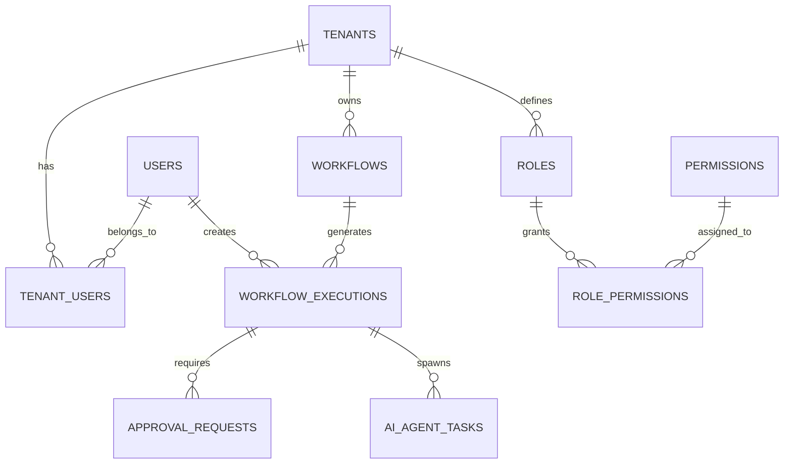

# Agent Derive Platform - Technical Architecture

## Overview

Agent Derive is a modern, enterprise-grade workflow automation platform built with Next.js 15 and TypeScript. It provides a visual workflow designer, AI agent orchestration, form builder, approval workflows, and comprehensive monitoring capabilities.

## Architecture Principles

### Design Philosophy
- **Enterprise-First**: Built for scalability, security, and multi-tenant architecture
- **Type Safety**: Strict TypeScript implementation with comprehensive type definitions
- **Performance-Optimized**: Leverages Next.js 15 features including App Directory and Turbo
- **Modular Design**: Component-based architecture with clear separation of concerns
- **API-First**: tRPC-based type-safe API layer with comprehensive error handling

### Core Architectural Patterns
- **Multi-tenant SaaS Architecture**: Complete tenant isolation at data and application levels
- **Event-Driven Architecture**: Inngest-powered asynchronous workflow execution
- **CQRS Pattern**: Separate read/write models for complex workflow operations
- **Repository Pattern**: Database abstraction with Drizzle ORM
- **Service Layer Architecture**: Business logic encapsulation in service classes

## Technology Stack

### Frontend Stack
```typescript
// Core Framework
- Next.js 15 (React 19, App Directory, Turbo)
- TypeScript 5.8+ (Strict mode)
- Tailwind CSS 4 (Utility-first styling)

// State Management
- Zustand (Global state management)
- TanStack Query (Server state management)
- React Hook Form (Form state management)

// UI Components
- Radix UI (Headless accessible components)
- ReactFlow (Workflow visual editor)
- SurveyJS (Dynamic form builder)
- Lucide React (Icon system)
- Recharts (Data visualization)

// Development Tools
- Storybook (Component development)
- Vitest (Unit testing)
- Playwright (E2E testing)
- ESLint 9 + Prettier (Code quality)
```

### Backend Stack
```typescript
// API Layer
- tRPC 11 (Type-safe RPC)
- Zod (Runtime type validation)
- SuperJSON (Serialization)

// Authentication & Authorization
- Auth0 (Identity provider)
- JWT (Session management)
- Role-based access control (RBAC)

// Database & ORM
- PostgreSQL (Primary database)
- Drizzle ORM (Type-safe database access)
- Neon (Database hosting)

// Workflow Engine
- Inngest (Event-driven functions)
- Inngest Agent Kit (AI agent orchestration)

// AI/ML Integration
- OpenAI API (GPT models)
- Anthropic API (Claude models)
- Hugging Face API (OSS models)
```

### Infrastructure & DevOps
```typescript
// Deployment & Hosting
- Vercel (Primary deployment platform)
- AWS (Enterprise infrastructure option)
- Docker (Containerization)

// Monitoring & Observability
- OpenTelemetry (Distributed tracing)
- Vercel Analytics (Performance monitoring)
- Sentry (Error tracking)

// Development Workflow
- GitHub Actions (CI/CD)
- Conventional Commits (Release management)
- Semantic Release (Automated versioning)
- Renovate (Dependency management)
```

## System Architecture

### High-Level Architecture
```
┌─────────────────────────────────────────────────────────────┐
│                     Client Layer                           │
├─────────────────────────────────────────────────────────────┤
│  Next.js App Router  │  React Components  │  State Mgmt    │
│  - Pages & Layouts   │  - UI Components   │  - Zustand     │
│  - Server Components│  - Form Builder    │  - TanStack    │
│  - Client Components│  - Workflow Canvas │  - React Hook  │
│                      │  - Dashboard       │    Form        │
├─────────────────────────────────────────────────────────────┤
│                     API Layer                              │
├─────────────────────────────────────────────────────────────┤
│  tRPC Routers       │  Middleware Stack   │  Type System   │
│  - Auth Router      │  - Authentication   │  - Zod Schemas │
│  - Workflow Router  │  - Authorization    │  - TypeScript  │
│  - Approval Router  │  - Tenant Isolation │  - SuperJSON   │
│  - AI Router        │  - Rate Limiting    │               │
├─────────────────────────────────────────────────────────────┤
│                   Business Logic Layer                     │
├─────────────────────────────────────────────────────────────┤
│  Service Layer      │  Workflow Engine    │  AI Integration│
│  - Workflow Service │  - Inngest Functions│  - Agent Kit   │
│  - Approval Service │  - Event Processing │  - LLM Clients │
│  - Tenant Service   │  - State Management │  - Tool System │
│  - Auth Service     │  - Error Handling   │  - Networking  │
├─────────────────────────────────────────────────────────────┤
│                     Data Layer                             │
├─────────────────────────────────────────────────────────────┤
│  Database Access    │  Schema Management  │  Caching       │
│  - Drizzle ORM      │  - Migrations       │  - Redis       │
│  - Connection Pool  │  - Seeding          │  - Query Cache │
│  - Query Builder    │  - Type Generation  │  - Session     │
│                     │                     │  - Store       │
├─────────────────────────────────────────────────────────────┤
│                   Infrastructure Layer                     │
├─────────────────────────────────────────────────────────────┤
│  Database          │  External Services   │  Monitoring    │
│  - PostgreSQL      │  - Auth0            │  - OpenTelemetry│
│  - Redis           │  - AI APIs          │  - Health Check │
│  - File Storage    │  - Email Service    │  - Error Track  │
└─────────────────────────────────────────────────────────────┘
```

### Data Architecture

#### Database Schema Design
```sql
-- Multi-tenant schema with row-level security
-- Core entities: Tenants, Users, Roles, Permissions
-- Workflow entities: Workflows, Executions, Approvals
-- AI entities: Agent Tasks, Tool Configurations
-- Audit entities: Logs, Events, Metrics
```

#### Entity Relationship Diagram


## Component Architecture

### Frontend Architecture
```
src/
├── app/                     # Next.js App Router
│   ├── dashboard/          # Main dashboard pages
│   ├── workflows/          # Workflow management
│   ├── approvals/          # Approval workflows
│   └── api/               # API routes
├── components/
│   ├── ui/                # Base UI components (Radix)
│   ├── layout/            # Layout components
│   ├── dashboard/         # Dashboard-specific components
│   ├── workflow-designer/ # Visual workflow editor
│   ├── form-builder/      # Dynamic form builder
│   └── workflow/          # Workflow execution components
├── lib/
│   ├── auth/              # Authentication logic
│   ├── trpc/              # tRPC client setup
│   ├── workflow/          # Workflow utilities
│   ├── templates/         # Workflow templates
│   └── inngest/           # Inngest integration
└── server/
    ├── routers/           # tRPC route definitions
    ├── context.ts         # Request context
    └── trpc.ts            # tRPC configuration
```

### Backend Architecture
```typescript
// tRPC Router Structure
export const appRouter = router({
  auth: authRouter,           // Authentication & authorization
  tenant: tenantRouter,       // Multi-tenant operations
  workflow: workflowRouter,   // Workflow CRUD operations
  execution: executionRouter, // Workflow execution management
  approval: approvalRouter,   // Approval workflow logic
  ai: aiRouter,              // AI agent orchestration
});

// Service Layer Pattern
class WorkflowService {
  constructor(
    private db: Database,
    private inngest: InngestClient,
    private aiService: AIService
  ) {}
  
  async createWorkflow(data: CreateWorkflowInput) {
    // Business logic implementation
  }
  
  async executeWorkflow(id: string) {
    // Workflow execution orchestration
  }
}
```

## Security Architecture

### Authentication & Authorization
- **Identity Provider**: Auth0 with OIDC/OAuth 2.0
- **Session Management**: JWT tokens with secure HTTP-only cookies
- **Role-Based Access Control**: Granular permissions with tenant isolation
- **API Security**: tRPC with input validation and authorization middleware

### Multi-Tenant Security
- **Data Isolation**: Row-level security with tenant ID filtering
- **Resource Isolation**: Tenant-scoped API endpoints
- **Cross-Tenant Prevention**: Middleware-enforced tenant boundaries
- **Audit Logging**: Comprehensive activity tracking per tenant

### Security Headers & Policies
```typescript
// Next.js Security Configuration
const securityHeaders = [
  { key: 'X-DNS-Prefetch-Control', value: 'on' },
  { key: 'Strict-Transport-Security', value: 'max-age=63072000' },
  { key: 'X-Frame-Options', value: 'DENY' },
  { key: 'X-Content-Type-Options', value: 'nosniff' },
  { key: 'Referrer-Policy', value: 'origin-when-cross-origin' },
  { key: 'Permissions-Policy', value: 'camera=(), microphone=()' }
];
```

## Performance Architecture

### Frontend Performance
- **Code Splitting**: Route-based and component-based code splitting
- **Bundle Optimization**: Tree shaking, dead code elimination
- **Image Optimization**: Next.js Image component with WebP support
- **Caching Strategy**: Static generation, ISR, and client-side caching

### Backend Performance
- **Database Optimization**: Connection pooling, query optimization, indexing
- **Caching Layer**: Redis for session store, query caching, and rate limiting
- **API Optimization**: Request batching, pagination, and efficient serialization
- **Monitoring**: OpenTelemetry tracing and performance metrics

### Workflow Performance
- **Async Processing**: Event-driven architecture with Inngest
- **Parallel Execution**: Concurrent workflow step processing
- **Resource Management**: Configurable concurrency limits and timeouts
- **Failure Handling**: Retry policies, circuit breakers, and graceful degradation

## Scalability Considerations

### Horizontal Scalability
- **Stateless Design**: Server components can scale horizontally
- **Database Scaling**: Read replicas, connection pooling
- **Caching Strategy**: Distributed Redis cluster
- **CDN Integration**: Static asset distribution

### Vertical Scalability
- **Resource Optimization**: Memory-efficient data structures
- **Query Performance**: Database indexing and query optimization
- **Processing Efficiency**: Optimized algorithms and data processing

### Auto-scaling
- **Container Orchestration**: Kubernetes deployment ready
- **Load Balancing**: Application load balancer configuration
- **Resource Monitoring**: CPU, memory, and database metrics
- **Scaling Triggers**: Automated scaling based on metrics

## Integration Architecture

### External Service Integration
```typescript
// AI Service Integration Pattern
interface AIServiceProvider {
  generateText(prompt: string): Promise<string>;
  analyzeDocument(document: Buffer): Promise<DocumentAnalysis>;
  processWorkflow(workflow: WorkflowDefinition): Promise<WorkflowResult>;
}

// Implementation for multiple providers
class OpenAIProvider implements AIServiceProvider { ... }
class AnthropicProvider implements AIServiceProvider { ... }
class HuggingFaceProvider implements AIServiceProvider { ... }
```

### Webhook Architecture
- **Outbound Webhooks**: Workflow events, approval notifications
- **Inbound Webhooks**: Third-party service integration
- **Security**: HMAC signature verification, rate limiting
- **Retry Logic**: Exponential backoff, dead letter queues

## Development Architecture

### Development Workflow
1. **Local Development**: Docker Compose for dependencies
2. **Testing Strategy**: Unit, integration, and E2E tests
3. **Code Quality**: ESLint, Prettier, TypeScript strict mode
4. **CI/CD Pipeline**: GitHub Actions with automated testing and deployment

### Code Organization Principles
- **Domain-Driven Design**: Feature-based directory structure
- **Separation of Concerns**: Clear boundaries between layers
- **Dependency Injection**: Service locator pattern for testability
- **Interface Segregation**: Small, focused interfaces

### Error Handling Strategy
```typescript
// Centralized error handling with proper typing
export class AppError extends Error {
  constructor(
    public code: string,
    public message: string,
    public statusCode: number = 500,
    public context?: Record<string, unknown>
  ) {
    super(message);
    this.name = 'AppError';
  }
}

// tRPC error handling
export const protectedProcedure = publicProcedure.use(async (opts) => {
  try {
    return await opts.next();
  } catch (error) {
    if (error instanceof AppError) {
      throw new TRPCError({
        code: 'INTERNAL_SERVER_ERROR',
        message: error.message,
        cause: error,
      });
    }
    throw error;
  }
});
```

## Monitoring & Observability

### Application Monitoring
- **Health Checks**: Kubernetes-compatible liveness/readiness probes
- **Metrics Collection**: Custom metrics with OpenTelemetry
- **Error Tracking**: Sentry integration with context capture
- **Performance Monitoring**: Real User Monitoring (RUM)

### Business Metrics
- **Workflow Analytics**: Execution success rates, completion times
- **User Engagement**: Dashboard usage, feature adoption
- **System Performance**: API response times, database query performance
- **Cost Optimization**: Resource utilization tracking

## Future Architecture Considerations

### Planned Enhancements
1. **Microservices Migration**: Gradual extraction of services
2. **Event Sourcing**: Complete audit trail with event store
3. **GraphQL Integration**: Alternative API layer for complex queries
4. **Mobile Apps**: React Native integration with shared business logic
5. **Edge Computing**: CDN-based edge functions for global performance

### Technology Evolution
- **Database**: Consider PostgreSQL extensions (TimescaleDB for metrics)
- **Search**: Elasticsearch for advanced workflow search and analytics
- **Real-time**: WebSocket integration for live workflow updates
- **AI/ML**: Custom model hosting and training capabilities